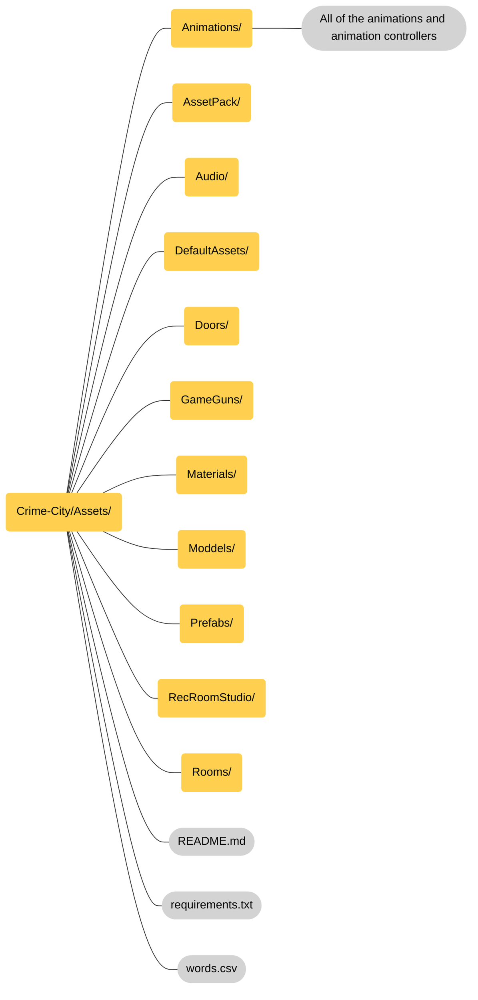

# Crime City

## Table of content
- [Why Git](#Why-Git)
    - [Introduction](#Introduction)
    - [What we gain](#what-we-gain)
- [Setupp](#Setupp)
- [How to do stuff](#how-to-do-stuff)
- [Studio file structure](#file-structure)

## Why Git

#### Introduction

Git is often used in game development. Now that Rec Room is developing Rec Room Studio and more content will be created in Unity, we should consider using Git to improve our workflow.

#### What we gain

Git allows us to use new features that the competition doesn't even know exist.

Some of these features are:
- **Collaberation**: we are able to work togheter in studio and recroom without interfering with or overwriting each other's changes.
- **Better testing**: Connect multiple projects. For example, we could have a public project for testers to ensure new features are thoroughly tested before release.
- **Shared Assets**: Rec Room currently removes unused models upon upload, preventing us from using each other's assets. Git allows everyone access to all models.
- **Automated tests**: Run unit and integration tests automatically to verify functionality. This is like having robots test our code!

## Setup

## How to do stuff

## File structure

> [!Note]
> We use PascalCase for naming folders.

